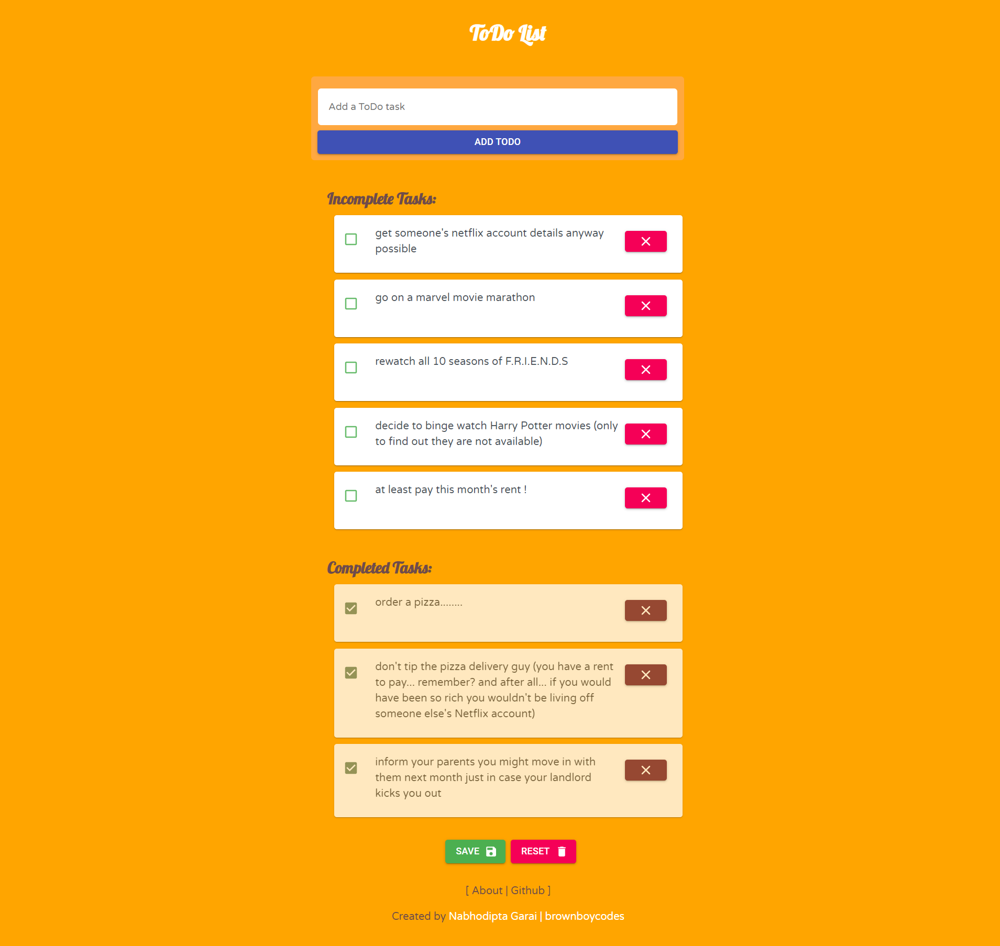
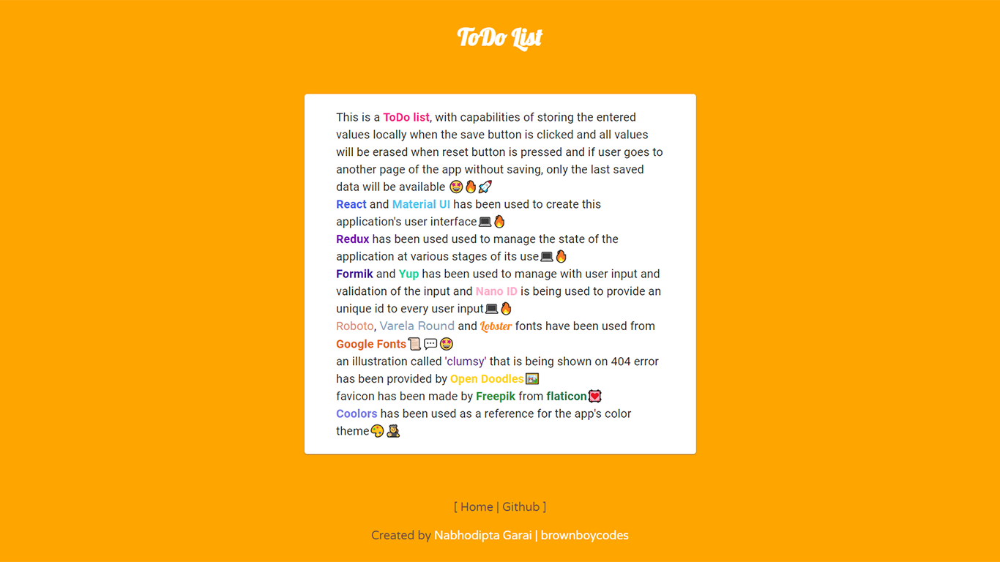
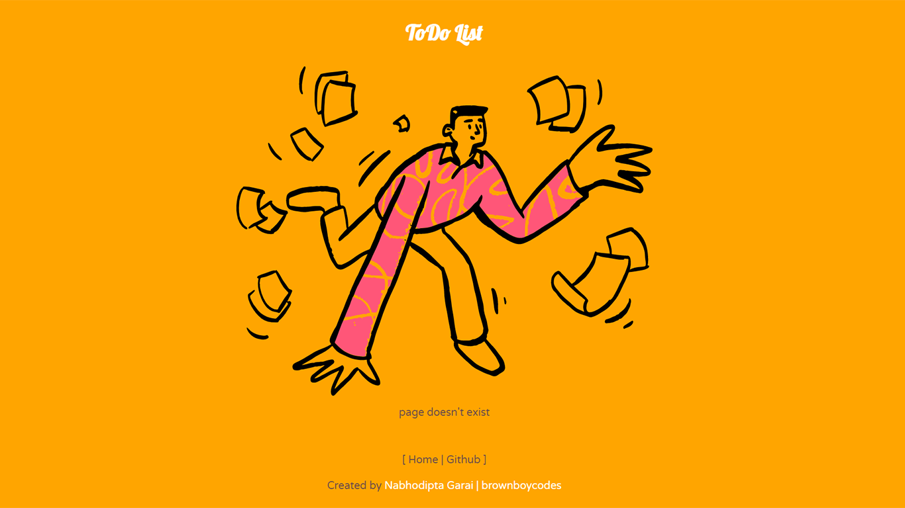

# ToDo_List

this ToDo List is a reworked version of an earlier one,
styling has been changed,
users no longer need to create an account for creating a ToDo List
instead users are provided with the options of saving their lists to localStorage and deleting it from there

## Homepage containing main ToDo List

---

## About page describing the project

---

\

## 404 page for responding to requests that do not exist

---

## To start the project on local server run

npm start

> created by Nabhodipta Garai | brownboycodes
